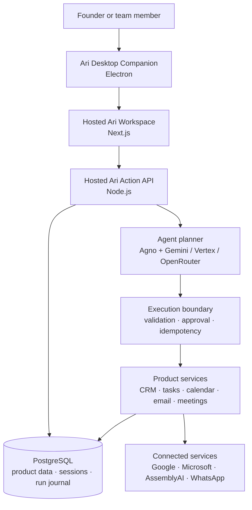
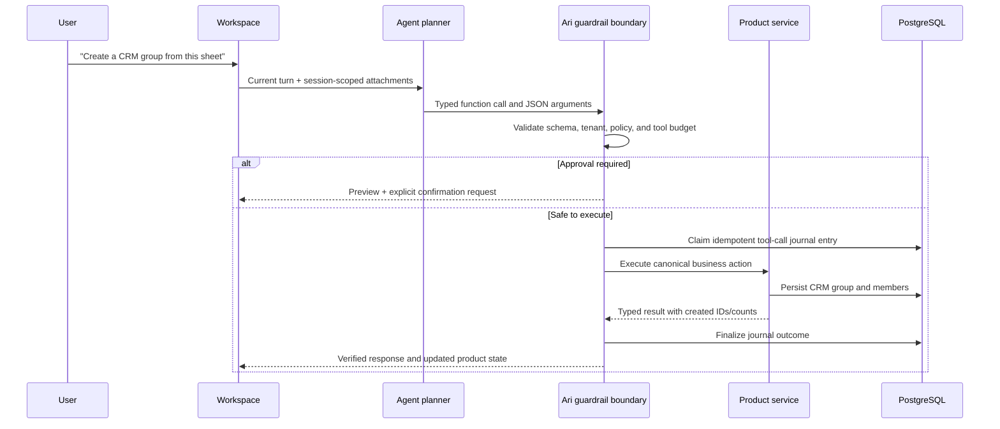
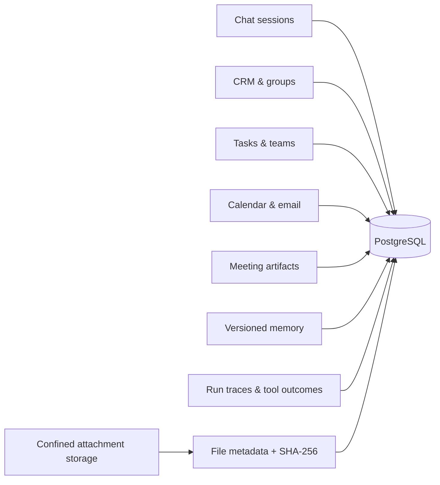

# Ari architecture

> A judge-friendly view of how Ari turns natural language into verified product state.

## System at a glance

The hosted workspace gives teams one shared system of record. The desktop
companion enables native workflows such as capture and dictation. The model
plans a task, but Node.js owns authorization, validation, confirmations,
execution, and the final statement of outcome.

## The difference: an execution system, not a chat wrapper

This boundary prevents the most harmful agent failure mode: an LLM replying
that work is complete when no verified mutation reached the product.

## Reliability and safety controls

| Risk | Ari control | Observable result |
| --- | --- | --- |
| Vague natural language | Current-turn, domain-aware capability selection | The model sees a compact relevant tool set instead of an uncontrolled catalog. |
| Invalid tool payload | Strict JSON schemas and canonical tool contracts | Unknown fields and malformed inputs fail before a handler runs. |
| Cross-user data access | Explicit tenant and session IDs at every boundary | IDs are resolved in the active user/session scope only. |
| Duplicate side effect | PostgreSQL tool-call journal and idempotency keys | Repeated calls return the saved typed result rather than creating duplicates. |
| Dangerous external action | Deterministic confirmation gate | Ari presents a preview and waits for an explicit approval. |
| Timeout or stop during mutation | Cancellation propagation and `unknown_outcome` state | Ari reports partial/uncertain work instead of replaying the mutation. |
| Provider outage | Explicit provider modes and pre-action fallback only | A fallback never blindly repeats a tool action after execution begins. |
| Stale or conflicting memory | Append-only fact versions with supersession | Corrections replace the active fact without erasing the historical record. |
| Untrusted file input | Session-scoped artifacts, MIME checks, hash/size/path validation | The agent can read only the files explicitly attached to the current session. |

## Runtime modes

| Mode | Model access | Intended use |
| --- | --- | --- |
| `ari` + Gemini | Native Gemini through Agno | Direct API-key development and production use. |
| `ari` + Vertex | Gemini through Vertex AI and Google credentials | Managed Google Cloud deployment. |
| `ari` + OpenRouter | OpenRouter through Agno | Provider flexibility while retaining Ari’s execution boundary. |
| `codex` | Direct user login through Codex App Server | Personal Codex-connected desktop workflow; credentials never become an API key. |
| `legacy` | Existing operator rollback path | Controlled operational fallback. |

## Data and service boundaries

PostgreSQL is the source of truth for product entities, sessions, summaries,
tool outcomes, and audit/run state. Large session file bytes remain in the shared
attachment directory or configured object storage; the database stores
ownership and integrity metadata rather than pretending to be blob storage.

## Code map

| Area | Location | Responsibility |
| --- | --- | --- |
| Product action boundary | `src/services/agent-tool-*.service.js` | Tool contracts, selection, execution, outcomes, and traces. |
| Agent bridge | `src/services/agno-agent*.js` and `agno_runtime/` | Model planning, protocol, and provider-specific setup. |
| Product domain | `src/services/`, `src/handlers/` | CRM, teams, reminders, email, calendar, meetings, and files. |
| API and lifecycle | `src/routes/`, `src/controllers/`, `src/index.js` | Authentication, request handling, hosted API lifecycle, and jobs. |
| Desktop experience | `desktop/` | Electron companion, recording, and dictation surfaces. |
| Workspace UI | `dashboard/` | Chat, CRM, tasks, teams, meetings, settings, and session UI. |
| Durable state | `migrations/`, PostgreSQL | Product data and agent runtime tables. |

## How we verify it

The repository contains focused checks for the failure modes above: typed tool
contracts, tenant/session isolation, confirmation policy, tool-result fidelity,
run coordination, attachment persistence, provider parity, and desktop smoke
flows. See the [verification commands in the README](../README.md#verify-the-product)
and the [smoke-test report](../SMOKE-TEST-REPORT.md).

For the implementation-level discussion, read [DESIGN.md](../DESIGN.md). For
the complete runtime contract, read [SHARED-AGENT-RUNTIME.md](SHARED-AGENT-RUNTIME.md).
